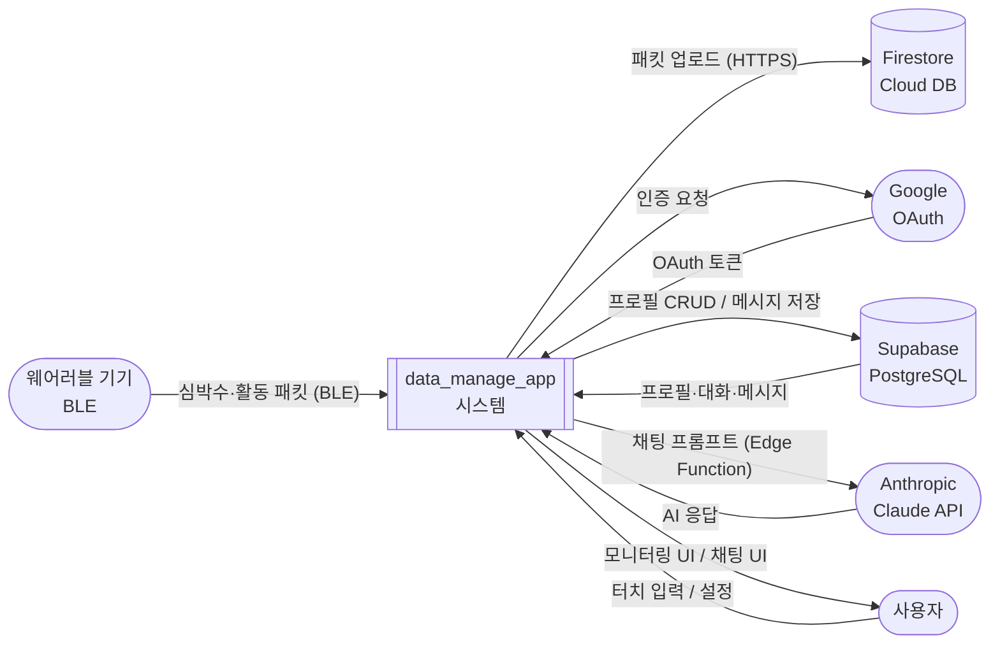
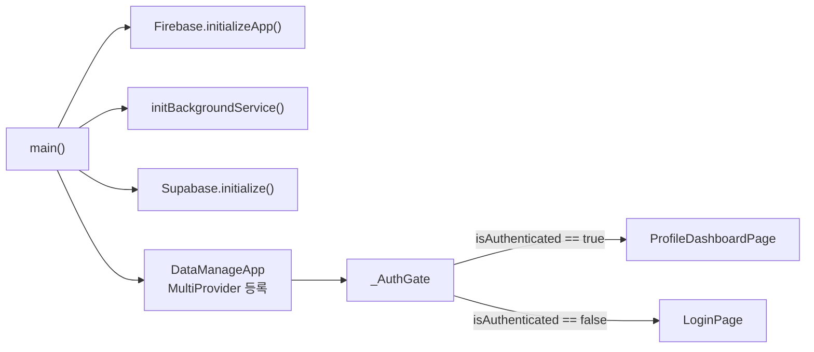
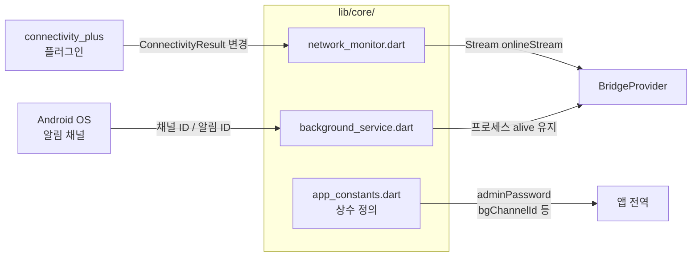
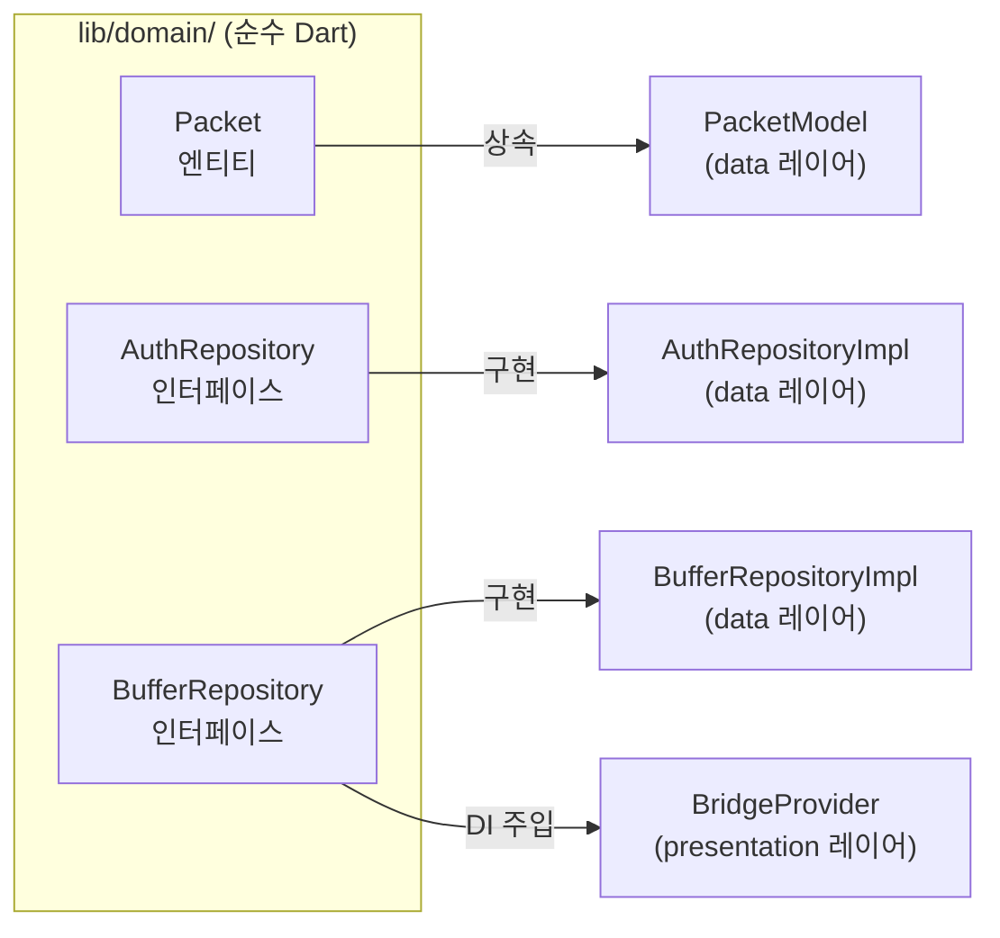
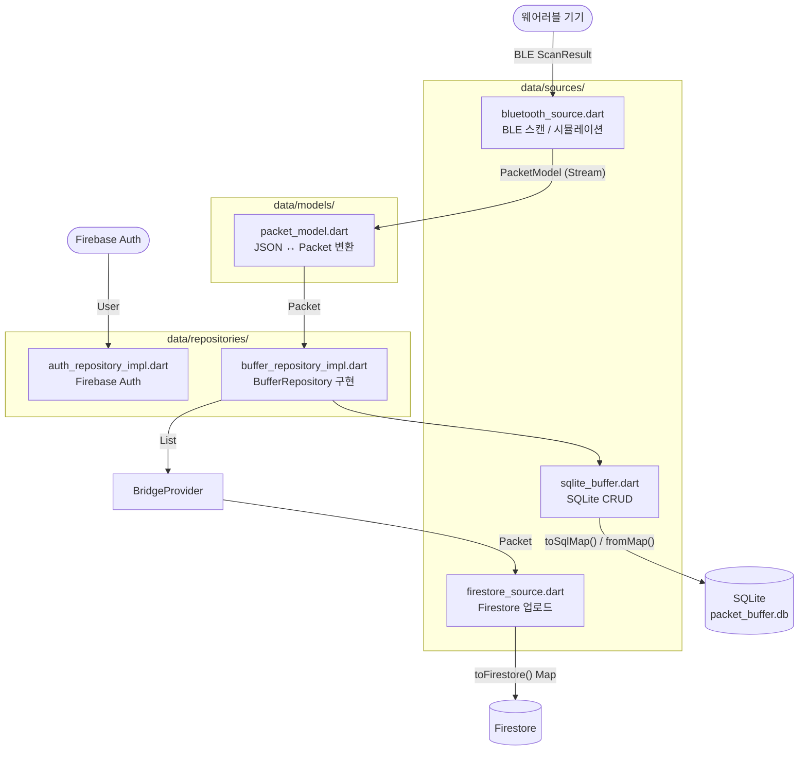
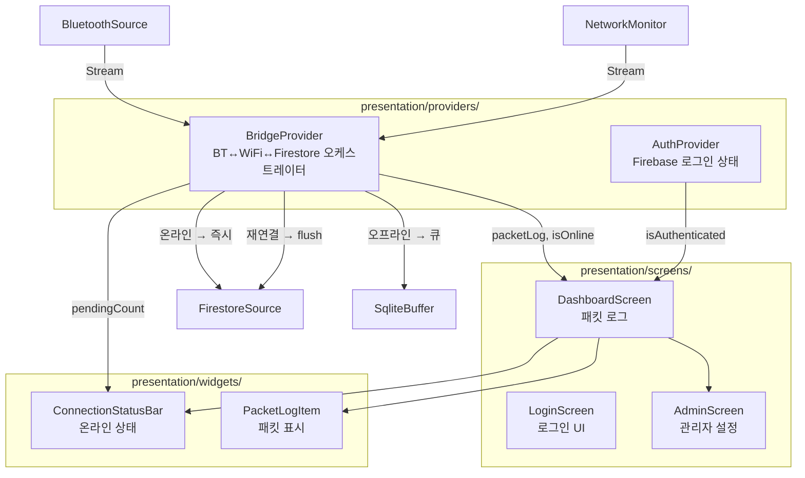
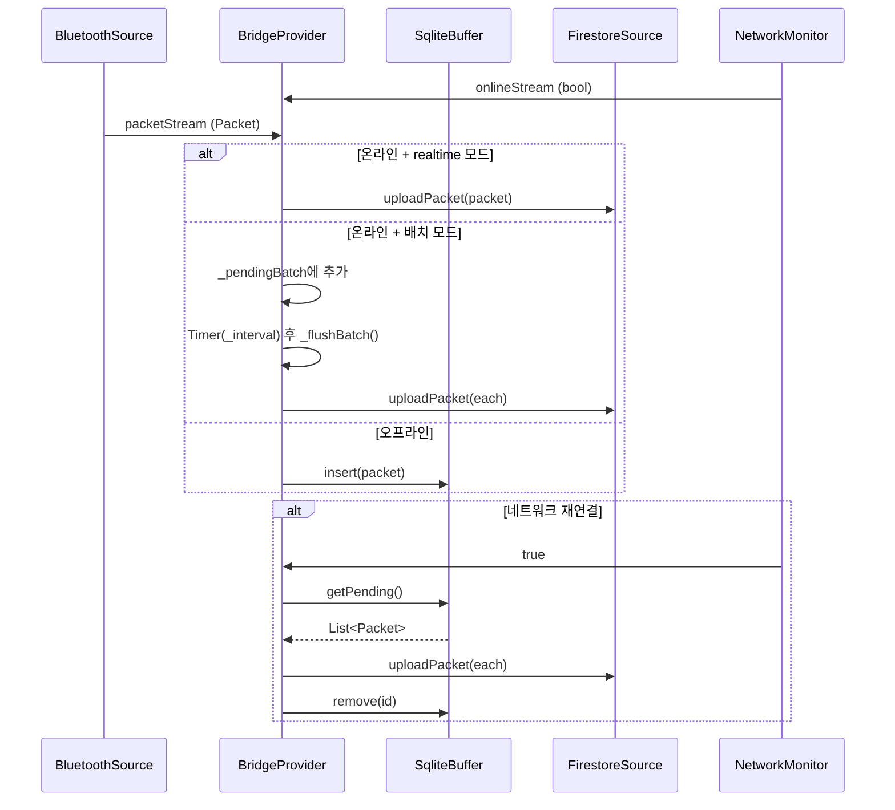
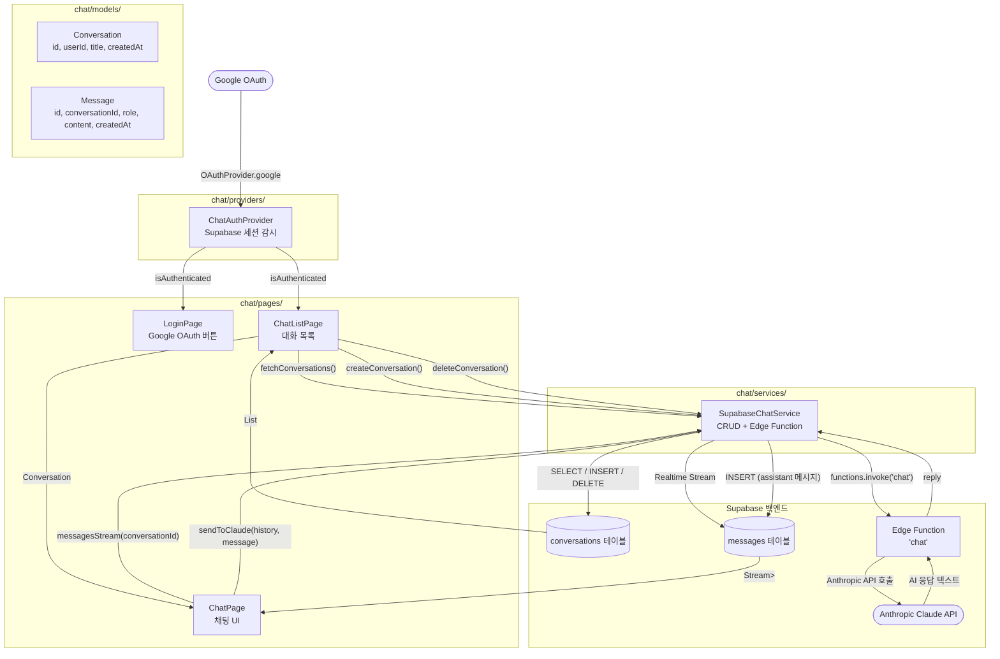
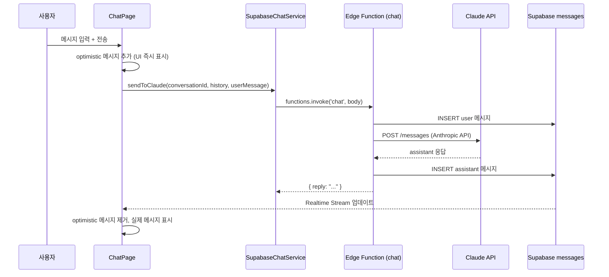
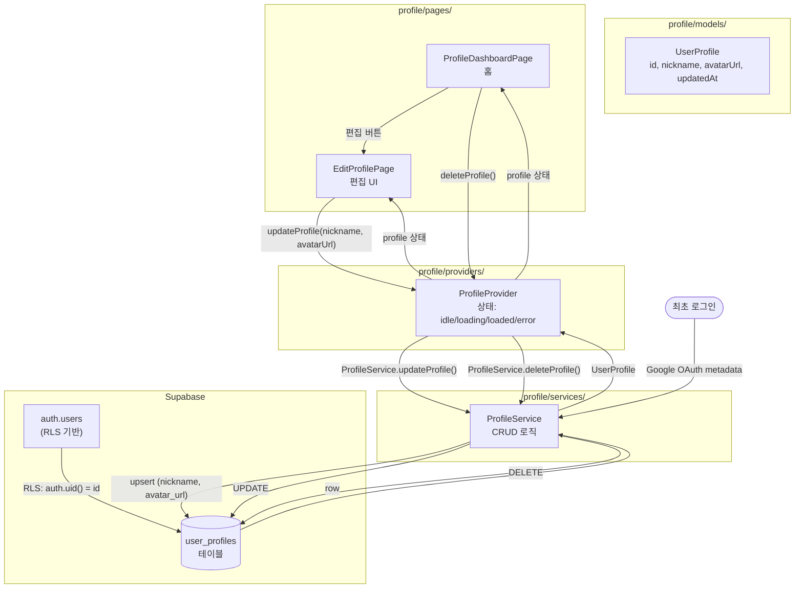

# data_manage_app

노인 상태 모니터링 및 데이터 브릿지 Flutter 앱.  
BLE 웨어러블 기기로부터 심박수·활동 데이터를 수집하고, 네트워크 상태에 따라 Firestore에 실시간 업로드하거나 SQLite에 오프라인 버퍼링합니다.  
사용자 인증·프로필 관리·AI 채팅은 Supabase(Google OAuth + Edge Function → Anthropic Claude)로 처리합니다.

---

## 목차

1. [기술 스택](#기술-스택)
2. [아키텍처 개요](#아키텍처-개요)
3. [DFD Level 0 — 컨텍스트 다이어그램](#dfd-level-0--컨텍스트-다이어그램)
4. [DFD Level 1 — 서브시스템 분해](#dfd-level-1--서브시스템-분해)
5. [폴더별 DFD 및 파일 설명](#폴더별-dfd-및-파일-설명)
   - [lib/main.dart](#libmaindart)
   - [lib/core/](#libcore)
   - [lib/domain/](#libdomain)
   - [lib/data/](#libdata)
   - [lib/presentation/](#libpresentation)
   - [lib/chat/](#libchat)
   - [lib/profile/](#libprofile)
   - [supabase/](#supabase)
6. [환경 설정](#환경-설정)
7. [실행 방법](#실행-방법)
8. [Android 백그라운드 서비스 설정](#android-백그라운드-서비스-설정)

---

## 기술 스택

| 영역 | 라이브러리 |
|------|-----------|
| UI 프레임워크 | Flutter 3.x (Dart 3.5+) |
| 상태 관리 | `provider` ^6.1 |
| 노인 모니터링 인증 | Firebase Auth + Google Sign-In |
| 클라우드 DB (모니터링) | Cloud Firestore |
| BLE 스캔 | `flutter_blue_plus` |
| 오프라인 버퍼 | `sqflite` |
| 네트워크 감지 | `connectivity_plus` |
| 백그라운드 서비스 | `flutter_background_service` |
| 사용자 인증 | Supabase Auth (Google OAuth) |
| 프로필 DB | Supabase PostgreSQL (`user_profiles`) |
| AI 채팅 백엔드 | Supabase Edge Function → Anthropic Claude |

---

## 아키텍처 개요

앱은 두 개의 독립적인 파이프라인으로 구성됩니다.

```
┌─────────────────────────────────────────────────────────┐
│  파이프라인 A — 노인 모니터링 (Firebase)                    │
│                                                         │
│  BLE Wearable ──► BluetoothSource ──► BridgeProvider   │
│                                          │    │         │
│                                    (온라인)  (오프라인)  │
│                                          │    │         │
│                                    Firestore SQLite    │
└─────────────────────────────────────────────────────────┘

┌─────────────────────────────────────────────────────────┐
│  파이프라인 B — 사용자 프로필 + AI 채팅 (Supabase)          │
│                                                         │
│  Google OAuth ──► ChatAuthProvider ──► ProfileProvider │
│                         │                    │          │
│                     ChatPage         Supabase DB        │
│                         │           (user_profiles)     │
│                   Edge Function                         │
│                         │                               │
│                  Anthropic Claude API                   │
└─────────────────────────────────────────────────────────┘
```

---

## DFD Level 0 — 컨텍스트 다이어그램

시스템 전체를 하나의 프로세스로 보고 외부 엔티티와의 데이터 흐름만 표시합니다.



---

## DFD Level 1 — 서브시스템 분해

앱 내부를 주요 처리 단위로 분해합니다.

```mermaid
flowchart TD
    subgraph External["외부 엔티티"]
        WD([웨어러블 BLE])
        NET([인터넷])
        GAUTH([Google OAuth])
    end

    subgraph CoreServices["P0 — 앱 초기화 / 핵심 서비스"]
        MAIN["main.dart\n(앱 부트스트랩)"]
        BGSVC["BackgroundService\n(포그라운드 서비스 유지)"]
        NETMON["NetworkMonitor\n(WiFi/LTE 감지)"]
    end

    subgraph BridgePipeline["P1 — 모니터링 브릿지 파이프라인"]
        BTSRC["BluetoothSource\n(BLE 스캔 + 시뮬레이션)"]
        BUFFREPO["BufferRepository\n(추상 인터페이스)"]
        SQLITE["SqliteBuffer\n(오프라인 큐)"]
        BRIDGE["BridgeProvider\n(오케스트레이터)"]
        FSSRC["FirestoreSource\n(클라우드 업로드)"]
    end

    subgraph AuthPipeline["P2 — 사용자 인증 / 프로필"]
        CAUTH["ChatAuthProvider\n(Supabase 세션)"]
        PROFPROV["ProfileProvider\n(상태 관리)"]
        PROFSVC["ProfileService\n(CRUD 로직)"]
        SUPADB[(Supabase\nuser_profiles)]
    end

    subgraph ChatPipeline["P3 — AI 채팅"]
        CHATPG["ChatPage\n(채팅 UI)"]
        CHATSVC["SupabaseChatService\n(대화·메시지 CRUD\n+ Edge Function 호출)"]
        EDGEFN["Supabase Edge Function\n(chat)"]
        CLAUDE([Anthropic Claude])
        SUPACONV[(Supabase\nconversations\nmessages)]
    end

    subgraph UI["P4 — 프레젠테이션 레이어"]
        AUTHGATE["_AuthGate\n(라우팅)"]
        DASHSCR["DashboardScreen\n(패킷 로그 표시)"]
        PROFDASH["ProfileDashboardPage\n(홈)"]
    end

    WD -->|BLE 패킷| BTSRC
    BTSRC -->|Packet Stream| BRIDGE
    NETMON -->|온라인/오프라인 bool| BRIDGE
    BRIDGE -->|오프라인 시 저장| BUFFREPO
    BUFFREPO --> SQLITE
    BRIDGE -->|온라인 시 업로드| FSSRC
    FSSRC -->|HTTPS| NET
    BGSVC -->|프로세스 유지| BRIDGE

    GAUTH -->|OAuth 콜백| CAUTH
    CAUTH -->|세션 상태| AUTHGATE
    AUTHGATE -->|인증됨| PROFDASH
    AUTHGATE -->|미인증| MAIN
    PROFDASH --> PROFPROV
    PROFPROV --> PROFSVC
    PROFSVC -->|upsert / select / delete| SUPADB

    PROFDASH --> CHATPG
    CHATPG --> CHATSVC
    CHATSVC -->|메시지 저장| SUPACONV
    CHATSVC -->|invoke('chat')| EDGEFN
    EDGEFN -->|프롬프트| CLAUDE
    CLAUDE -->|AI 응답| EDGEFN
    EDGEFN -->|reply| CHATSVC
    SUPACONV -->|Realtime Stream| CHATPG

    BRIDGE --> DASHSCR
```

---

## 폴더별 DFD 및 파일 설명

### `lib/main.dart`

앱의 진입점. Firebase와 Supabase를 초기화하고 모든 Provider를 등록합니다.



| 항목 | 설명 |
|------|------|
| `DataManageApp` | 루트 위젯. `MultiProvider`로 `AuthProvider`, `BridgeProvider`, `ChatAuthProvider`, `ProfileProvider` 등록 |
| `_AuthGate` | `ChatAuthProvider.isAuthenticated` 상태를 감시하여 로그인/대시보드로 라우팅 |

---

### `lib/core/`

앱 전반에 걸쳐 재사용되는 서비스와 상수.

```
lib/core/
├── constants/
│   └── app_constants.dart      # 전역 상수 (관리자 비밀번호, 알림 채널 ID 등)
└── services/
    ├── background_service.dart  # 포그라운드 서비스 설정 및 시작
    └── network_monitor.dart     # 네트워크 상태 감지 스트림
```



**파일별 역할**

| 파일 | 입력 | 출력 | 역할 |
|------|------|------|------|
| `app_constants.dart` | — | 상수값 | `adminPassword`, `bgChannelId`, `bgNotificationId` 등 앱 전역 상수 |
| `background_service.dart` | `main()`에서 호출 | Android 포그라운드 서비스 | `flutter_background_service` 설정. 30초마다 heartbeat 이벤트 발생 |
| `network_monitor.dart` | `connectivity_plus` 플러그인 이벤트 | `Stream<bool>` | WiFi/LTE/이더넷 연결 여부를 bool 스트림으로 변환 |

---

### `lib/domain/`

비즈니스 규칙의 순수 Dart 계층. 외부 의존성 없음.

```
lib/domain/
├── entities/
│   └── packet.dart             # 심박수·활동 데이터 엔티티
└── repositories/
    ├── auth_repository.dart     # 인증 추상 인터페이스
    └── buffer_repository.dart   # 패킷 버퍼 추상 인터페이스
```



**파일별 역할**

| 파일 | 역할 |
|------|------|
| `entities/packet.dart` | `id`, `timestamp`, `heartRate`, `activity`, `sent` 필드를 갖는 불변 엔티티. `statusLabel` getter 제공 |
| `repositories/auth_repository.dart` | 로그인·로그아웃·현재 사용자 조회 추상 메서드 정의 |
| `repositories/buffer_repository.dart` | `savePacket`, `getPendingPackets`, `deletePacket`, `getPendingCount` 추상 메서드 정의 |

---

### `lib/data/`

외부 데이터 소스 접근 및 도메인 인터페이스 구현.

```
lib/data/
├── models/
│   └── packet_model.dart           # PacketModel (Packet 확장, 직렬화 포함)
├── repositories/
│   ├── auth_repository_impl.dart   # Firebase Auth 구현
│   └── buffer_repository_impl.dart # SQLite 버퍼 구현
└── sources/
    ├── bluetooth_source.dart        # BLE 스캔 + 폴백 시뮬레이션
    ├── firestore_source.dart        # Firestore 업로드
    └── sqlite_buffer.dart           # SQLite CRUD
```



**파일별 역할**

| 파일 | 입력 데이터 | 출력 데이터 | 역할 |
|------|------------|------------|------|
| `models/packet_model.dart` | `Map<String, dynamic>` (SQLite row) | `PacketModel` | `fromMap()` 역직렬화, `toSqlMap()` SQLite 저장용, `toFirestore()` Firestore 업로드용 변환 제공 |
| `sources/bluetooth_source.dart` | `FlutterBluePlus.scanResults` 스트림 | `Stream<Packet>` | BLE 스캔 시도. BT 미지원 환경에서는 1초마다 랜덤 PacketModel 시뮬레이션 |
| `sources/firestore_source.dart` | `Packet` | Firestore `packets` 컬렉션 | `uploadPacket()` — `toFirestore()` 변환 후 `collection('packets').doc(id).set()` |
| `sources/sqlite_buffer.dart` | `Packet` | `List<PacketModel>` | `insert` / `getPending` / `remove` / `pendingCount`. `sent=0` 조건으로 미전송 패킷 큐 관리 |
| `repositories/auth_repository_impl.dart` | Firebase Auth | `AuthRepository` | Firebase 기반 로그인·로그아웃 구현 |
| `repositories/buffer_repository_impl.dart` | `SqliteBuffer` | `BufferRepository` | `SqliteBuffer`를 `BufferRepository` 인터페이스로 위임 |

---

### `lib/presentation/`

노인 모니터링 파이프라인의 UI 레이어.

```
lib/presentation/
├── providers/
│   ├── auth_provider.dart      # Firebase 인증 상태 관리
│   └── bridge_provider.dart    # BT→WiFi→Firestore 오케스트레이터
├── screens/
│   ├── admin_screen.dart       # 관리자 설정 화면
│   ├── dashboard_screen.dart   # 패킷 로그 대시보드
│   └── login_screen.dart       # Firebase 로그인 화면
└── widgets/
    ├── connection_status_bar.dart  # 온라인/오프라인 상태 표시 바
    └── packet_log_item.dart        # 패킷 로그 리스트 아이템
```



**BridgeProvider 데이터 흐름 상세**



**파일별 역할**

| 파일 | 역할 |
|------|------|
| `providers/auth_provider.dart` | Firebase Auth 래퍼. `signIn`, `signOut`, `currentUser` 상태 노출 |
| `providers/bridge_provider.dart` | 핵심 오케스트레이터. BT 스캔 시작, 네트워크 감시, 온라인/오프라인 분기, SQLite 버퍼 flush, 패킷 로그(최대 100건) 유지 |
| `screens/dashboard_screen.dart` | `BridgeProvider`의 `packetLog`를 `ListView`로 표시. 관리자 비밀번호 다이얼로그 → `AdminScreen` 진입 |
| `screens/admin_screen.dart` | 배치 전송 주기(`StreamInterval`) 설정 UI |
| `screens/login_screen.dart` | Firebase Google 로그인 버튼 |
| `widgets/connection_status_bar.dart` | `BridgeProvider.isOnline`, `pendingCount` 표시 |
| `widgets/packet_log_item.dart` | 단일 패킷(심박수, 활동량, 전송 상태)을 카드로 렌더링 |

---

### `lib/chat/`

Supabase 기반 AI 채팅 기능 모듈.

```
lib/chat/
├── models/
│   ├── conversation.dart   # 대화 엔티티
│   └── message.dart        # 메시지 엔티티 (user | assistant)
├── pages/
│   ├── chat_list_page.dart # 대화 목록 페이지
│   ├── chat_page.dart      # 채팅 UI (메시지 입력/표시)
│   └── login_page.dart     # Supabase Google OAuth 로그인
├── providers/
│   └── chat_auth_provider.dart  # Supabase 세션 상태 관리
└── services/
    └── supabase_chat_service.dart  # Supabase DB + Edge Function 호출
```



**채팅 메시지 전송 시퀀스**



**파일별 역할**

| 파일 | 입력 | 출력 | 역할 |
|------|------|------|------|
| `models/conversation.dart` | Supabase row Map | `Conversation` | `fromMap()` / `toInsertMap()` 변환 |
| `models/message.dart` | Supabase row Map | `Message` | `fromMap()` / `toInsertMap()`, `MessageRole` enum (`user`/`assistant`) |
| `pages/login_page.dart` | 사용자 탭 | Google OAuth 콜백 | `ChatAuthProvider.signInWithGoogle()` 호출 |
| `pages/chat_list_page.dart` | `SupabaseChatService` | 대화 목록 UI | 대화 생성·삭제, `ChatPage`로 이동 |
| `pages/chat_page.dart` | `Conversation`, 메시지 스트림 | 채팅 UI | Realtime 메시지 구독, 낙관적 업데이트, 전송 |
| `providers/chat_auth_provider.dart` | Supabase `onAuthStateChange` | `isAuthenticated`, `User?` | Google OAuth signIn/signOut, 세션 자동 복원 |
| `services/supabase_chat_service.dart` | Dart 호출 | Supabase DB / Edge Function | `fetchConversations`, `createConversation`, `deleteConversation`, `messagesStream`, `insertMessage`, `sendToClaude` |

---

### `lib/profile/`

Supabase `user_profiles` 테이블 기반 프로필 CRUD 모듈.

```
lib/profile/
├── models/
│   └── user_profile.dart         # UserProfile 엔티티
├── pages/
│   ├── edit_profile_page.dart    # 닉네임·아바타 편집 UI
│   └── profile_dashboard_page.dart  # 홈 화면 (프로필 + 채팅 진입)
├── providers/
│   └── profile_provider.dart    # 프로필 상태 관리 (idle/loading/loaded/error)
└── services/
    └── profile_service.dart     # Supabase CRUD 로직
```



**파일별 역할**

| 파일 | 역할 |
|------|------|
| `models/user_profile.dart` | `fromMap()` (Supabase row 역직렬화), `toUpsertMap()` (INSERT/UPDATE 직렬화), `copyWith()` |
| `pages/profile_dashboard_page.dart` | 앱 홈. 프로필 카드, 채팅 목록으로 이동, 프로필 편집/삭제, 로그아웃 버튼 |
| `pages/edit_profile_page.dart` | 닉네임·아바타 URL 입력 폼. `ProfileProvider.updateProfile()` 호출 |
| `providers/profile_provider.dart` | `loadProfile()` (fetchProfile → 없으면 createFromGoogle), `updateProfile()`, `deleteProfile()` 상태 머신 |
| `services/profile_service.dart` | Supabase `user_profiles` 직접 접근. `fetchProfile`, `upsertProfile`, `createFromGoogle`, `updateProfile`, `deleteProfile` |

---

### `supabase/`

Supabase 데이터베이스 마이그레이션 파일.

```
supabase/
└── migrations/
    └── 20240101000000_user_profiles.sql   # user_profiles 테이블 생성 + RLS
```

```mermaid
erDiagram
    auth_users {
        uuid id PK
    }
    user_profiles {
        uuid id PK_FK
        text nickname
        text avatar_url
        timestamptz updated_at
    }
    conversations {
        uuid id PK
        uuid user_id FK
        text title
        timestamptz created_at
    }
    messages {
        uuid id PK
        uuid conversation_id FK
        text role
        text content
        timestamptz created_at
    }

    auth_users ||--o| user_profiles : "1:1 (ON DELETE CASCADE)"
    auth_users ||--o{ conversations : "1:N"
    conversations ||--o{ messages : "1:N"
```

**마이그레이션 파일 역할**

| 파일 | 역할 |
|------|------|
| `20240101000000_user_profiles.sql` | `user_profiles` 테이블 생성, `set_updated_at` 트리거 설정, RLS 정책 4개 적용 (SELECT/INSERT/UPDATE/DELETE 각각 `auth.uid() = id` 조건), Realtime publication 등록 |

**RLS 정책 요약**

| 정책 | 조건 |
|------|------|
| `profiles_select_own` | `auth.uid() = id` — 자신의 행만 조회 |
| `profiles_insert_own` | `auth.uid() = id` — 자신의 행만 삽입 |
| `profiles_update_own` | `auth.uid() = id` — 자신의 행만 수정 |
| `profiles_delete_own` | `auth.uid() = id` — 자신의 행만 삭제 |

---

## 환경 설정

### Firebase

1. [Firebase 콘솔](https://console.firebase.google.com)에서 프로젝트 생성
2. Android/iOS 앱 등록 후 `google-services.json` / `GoogleService-Info.plist` 다운로드
3. 각 플랫폼 디렉터리에 배치:
   - `android/app/google-services.json`
   - `ios/Runner/GoogleService-Info.plist`

### Supabase

1. [Supabase 대시보드](https://supabase.com/dashboard)에서 프로젝트 생성
2. SQL Editor에서 마이그레이션 실행:
   ```sql
   -- supabase/migrations/20240101000000_user_profiles.sql 내용 붙여넣기
   ```
3. Authentication → Providers → Google OAuth 활성화
4. Edge Functions에 `chat` 함수 배포 (Anthropic API 키 환경 변수 설정 필요)

---

## 실행 방법

```bash
# 의존성 설치
flutter pub get

# Supabase 자격 증명을 환경 변수로 주입하여 실행
flutter run \
  --dart-define=SUPABASE_URL=https://YOUR_PROJECT_ID.supabase.co \
  --dart-define=SUPABASE_ANON_KEY=eyJ...YOUR_ANON_KEY
```

> **보안 주의**: `SUPABASE_URL`과 `SUPABASE_ANON_KEY`를 소스 코드에 직접 커밋하지 마세요.  
> CI/CD 환경에서는 시크릿 관리자 또는 `.env` 파일(`.gitignore` 등록 필수)을 활용하세요.

---

## Android 백그라운드 서비스 설정

`flutter_background_service`를 Android에서 사용하려면 `AndroidManifest.xml`에 아래 항목을 추가해야 합니다.

```xml
<!-- android/app/src/main/AndroidManifest.xml -->
<uses-permission android:name="android.permission.FOREGROUND_SERVICE" />
<uses-permission android:name="android.permission.FOREGROUND_SERVICE_DATA_SYNC" />

<application ...>
    <service
        android:name="id.flutter.flutter_background_service.BackgroundService"
        android:foregroundServiceType="dataSync"
        android:exported="false" />
</application>
```
