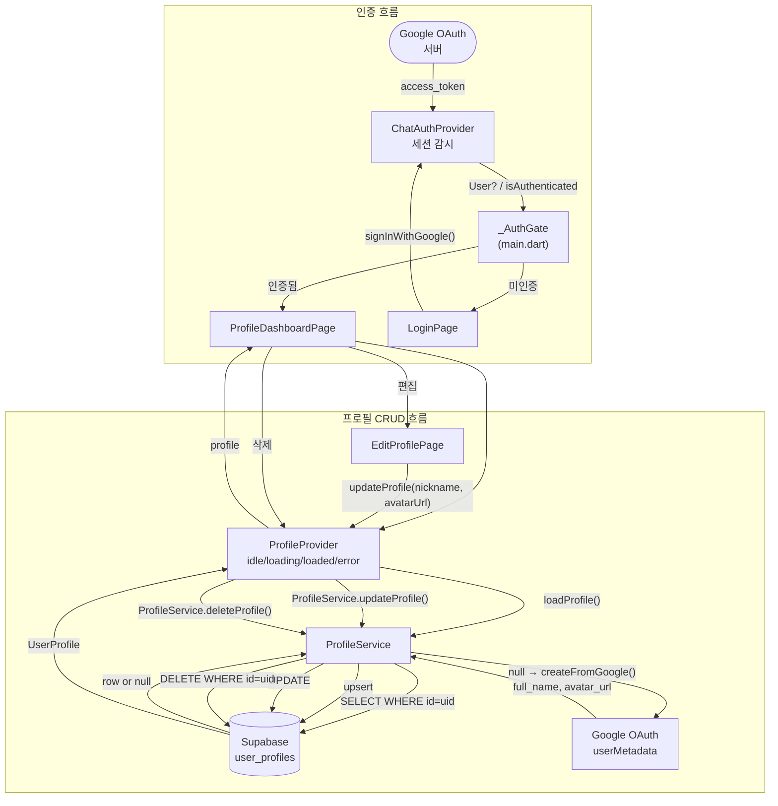
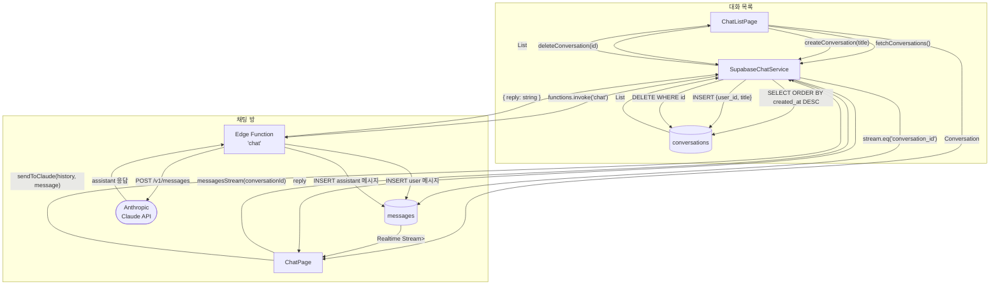
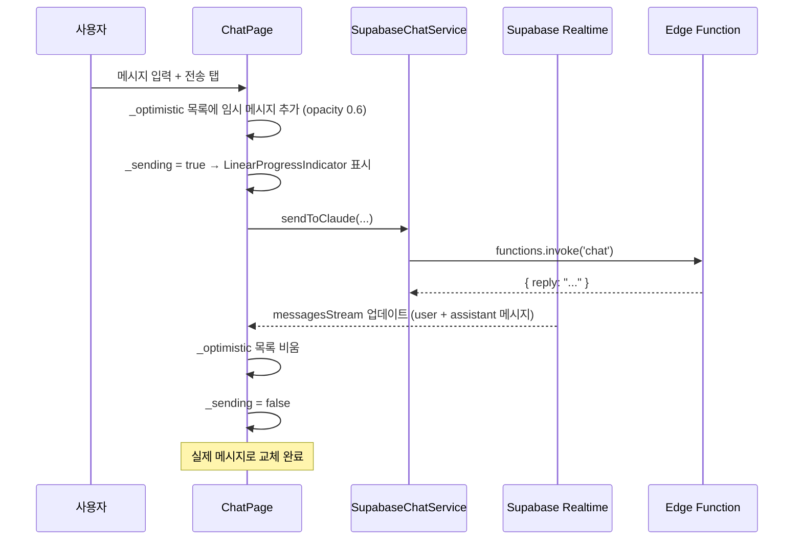

# DFD — 사용자 프로필 + AI 채팅 파이프라인

## 개요

Supabase를 백엔드로 사용하는 두 가지 기능:
1. **사용자 프로필 CRUD** — Google OAuth 로그인 후 `user_profiles` 테이블 관리
2. **AI 채팅** — Supabase Edge Function을 통해 Anthropic Claude API 호출

---

## 관련 파일

```
lib/
├── chat/
│   ├── models/
│   │   ├── conversation.dart       ← 대화 엔티티
│   │   └── message.dart            ← 메시지 엔티티
│   ├── pages/
│   │   ├── login_page.dart         ← OAuth 로그인 UI
│   │   ├── chat_list_page.dart     ← 대화 목록
│   │   └── chat_page.dart          ← 채팅 UI
│   ├── providers/
│   │   └── chat_auth_provider.dart ← Supabase 세션 상태
│   └── services/
│       └── supabase_chat_service.dart ← DB + Edge Function
├── profile/
│   ├── models/
│   │   └── user_profile.dart       ← 프로필 엔티티
│   ├── pages/
│   │   ├── profile_dashboard_page.dart ← 홈 화면
│   │   └── edit_profile_page.dart  ← 편집 UI
│   ├── providers/
│   │   └── profile_provider.dart   ← 프로필 상태 관리
│   └── services/
│       └── profile_service.dart    ← Supabase CRUD
└── supabase/migrations/
    └── 20240101000000_user_profiles.sql ← DB 스키마 + RLS
```

---

## DFD Level 1 — 인증 + 프로필



---

## DFD Level 1 — AI 채팅



---

## 낙관적 업데이트 (Optimistic UI)



---

## 데이터 구조

### UserProfile

```
UserProfile
├── id: String (UUID)         Supabase auth.users.id와 동일
├── nickname: String?         표시명 (nullable)
├── avatarUrl: String?        프로필 이미지 URL (nullable)
└── updatedAt: DateTime       마지막 수정 시각 (트리거 자동 갱신)
```

### Conversation

```
Conversation
├── id: String (UUID)
├── userId: String (UUID)     auth.users.id FK
├── title: String             대화 제목
└── createdAt: DateTime
```

### Message

```
Message
├── id: String (UUID)
├── conversationId: String    conversations.id FK
├── role: MessageRole         user | assistant
├── content: String           메시지 본문
└── createdAt: DateTime
```

---

## Supabase 테이블 구조 및 RLS

```
user_profiles
├── id UUID PK → auth.users(id) ON DELETE CASCADE
├── nickname TEXT
├── avatar_url TEXT
└── updated_at TIMESTAMPTZ (트리거 자동 관리)

RLS 정책: 모든 CRUD 작업에 auth.uid() = id 조건 적용
→ 각 사용자는 자신의 행에만 접근 가능
```

Edge Function `chat`에서 Anthropic API 키가 필요합니다.  
Supabase 대시보드 → Edge Functions → Secrets에 `ANTHROPIC_API_KEY` 등록 필요.
