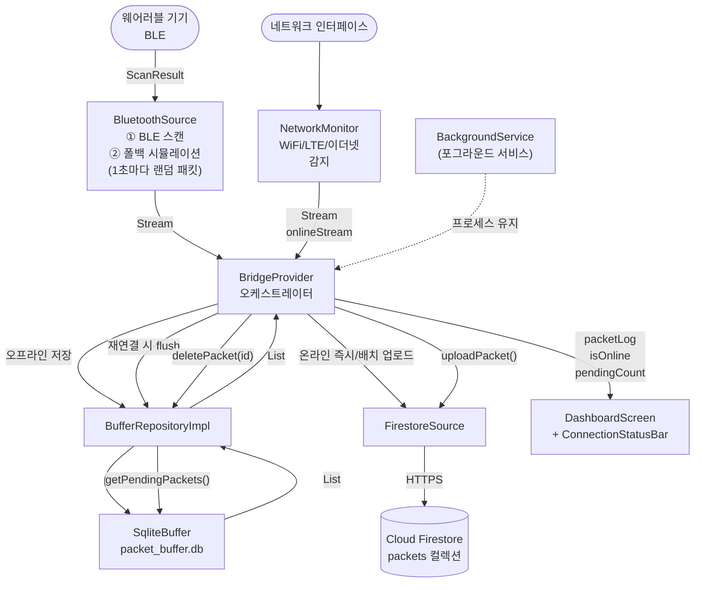
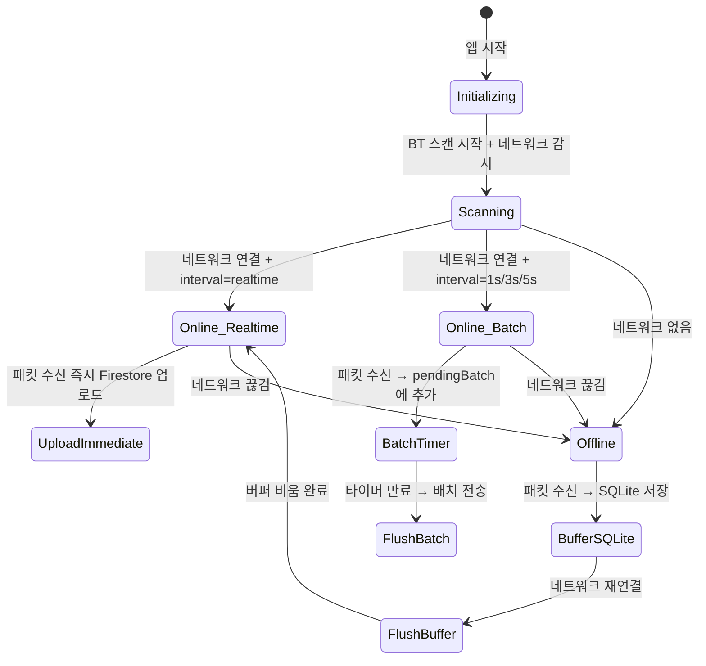

# DFD — 노인 모니터링 브릿지 파이프라인

## 개요

BLE 웨어러블 기기로부터 심박수·활동 데이터를 수집하여 Firestore에 업로드하는 파이프라인.  
네트워크 단절 시 SQLite에 버퍼링하고, 재연결 시 자동 flush.

---

## 관련 파일

```
lib/
├── core/services/
│   ├── background_service.dart   ← 프로세스 생존 유지
│   └── network_monitor.dart      ← WiFi/LTE 감지
├── domain/
│   ├── entities/packet.dart      ← 데이터 구조 정의
│   └── repositories/
│       └── buffer_repository.dart ← 버퍼 추상 인터페이스
├── data/
│   ├── models/packet_model.dart  ← 직렬화/역직렬화
│   ├── sources/
│   │   ├── bluetooth_source.dart ← BLE 스캔
│   │   ├── firestore_source.dart ← 클라우드 업로드
│   │   └── sqlite_buffer.dart    ← 오프라인 큐
│   └── repositories/
│       └── buffer_repository_impl.dart ← 인터페이스 구현
└── presentation/providers/
    └── bridge_provider.dart      ← 오케스트레이터
```

---

## DFD Level 1



---

## 데이터 흐름 상태 머신



---

## Packet 데이터 구조

```
Packet (domain/entities)
├── id: String          "WEAR-XXXXXXXX"
├── timestamp: DateTime  수집 시각
├── heartRate: int       심박수 (55~104 bpm)
├── activity: int        활동량 (0~99)
└── sent: bool           Firestore 전송 완료 여부

PacketModel (data/models) — Packet 확장
├── fromMap(Map)         SQLite row → PacketModel
├── toSqlMap()           SQLite 저장용 Map
├── toFirestore()        Firestore 업로드용 Map
│   ├── timestamp: ISO8601
│   ├── heartRate
│   ├── activity
│   └── deviceId: id.split('-').first
└── copyWithSent(bool)   sent 상태 업데이트
```

---

## SQLite 스키마

```sql
CREATE TABLE packets (
  id        TEXT    PRIMARY KEY,
  timestamp INTEGER NOT NULL,   -- millisecondsSinceEpoch
  heartRate INTEGER NOT NULL,
  activity  INTEGER NOT NULL,
  sent      INTEGER NOT NULL DEFAULT 0  -- 0=미전송, 1=전송완료
);
```

미전송(`sent=0`) 패킷만 `getPending()`으로 조회하여 FIFO 순으로 flush.
